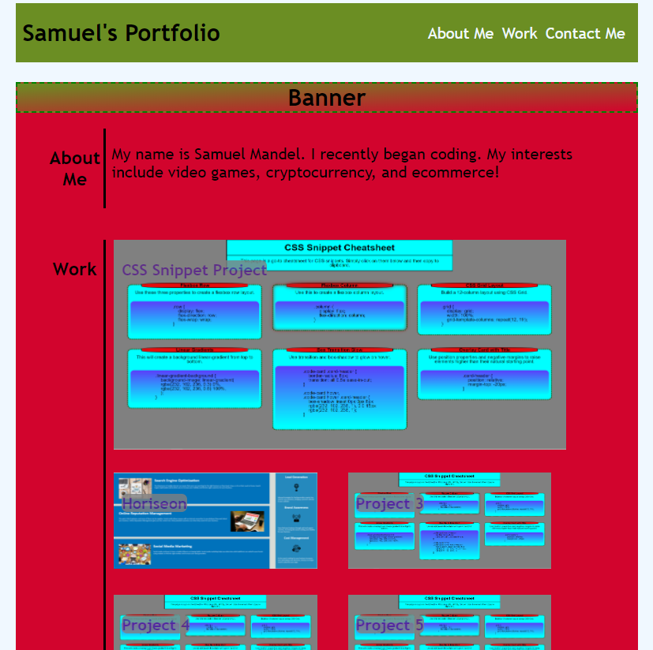

# Portfolio


## Description

This is a website built to host links and previews of the work I have done. 


## Site Picture



## Technologies Used
- HTML - provided elements to the page
- CSS - provided styling
- Git - version control
- Github - hosts GitHub Pages of the site and hosts my portfolion repository

## Key pieces of the Project

Flexboxes were key to the deployment of this website's formatting within the main article of the webpage. 

The asides occupy ten percent of the left of the main portion of the page and all content occupies the right 90% of the flex boxes.

This code shows how I achieved splitting the figure containing the work portion of the webpage.

```CSS
aside{
    text-align: center;
    flex: 0 0 10%;
    border-right: 3px solid black;
}

/*container holds projects in work aside */
#container {
    flex: 0 0 90%;
    display: flex;
    flex-direction: row;
    flex-wrap: wrap;
    
}
```
The right hand side of work needed some additional flexboxes as well as titles that stuck to the image links.

```CSS
/* main project */
#showcase {
    flex: 0 0 100%;
    padding-left: .5em;

    position: relative;
}

#showcaseTitle{
    position: absolute;
    margin-bottom: -1em;
    margin-left: .5rem;
    margin-right: 80%;
    /* makes title stay in one line */
    white-space: nowrap;
    background-color: gray;
    opacity: 80%;
    border-radius: 7px;
    
}
#showcaseTitle:hover{
    background-color: blue;
    color: white;
}
img {
    width: 90%;
    height: 90%;
}
/* small projects */
.smallProject{
    flex: 0 0 45%;
    padding-left: .5em;
    padding-bottom: 3%;
}

#smallProjectTitle{
    display: flex;
    position: absolute;
    margin-bottom: -1em;
    margin-left: .5rem;
    margin-right: 80%;
    /* makes title stay in one line */
    white-space: nowrap;
    background-color: gray;
    opacity: 80%;
    border-radius: 7px;
    
}
```

```HTML
<article>
            <section>
                <figure>
                    <aside id="aboutMe">
                        <h3>About Me</h3>
                    </aside>                
                    <p id="info">
                        My name is Samuel Mandel. I recently began coding. My interests include video games, cryptocurrency, and ecommerce!
                    </p>
                </figure>
            </section> 
            <section>
                <figure>
                    <aside id="work">
                        <h3>Work</h3>
                    </aside> 
                    <div id="container"> 
                        <div id="showcase">
                            <a href="https://luccaloopz.github.io/mini-project-2/">
                                <h4 id ="showcaseTitle">CSS Snippet Project</h4>
                                
                            </a>
                        </div>
                        <div class="smallProject">
                            <a href="https://sambalogna.github.io/site-refactor/">
                                <h4 id = "smallProjectTitle">Horiseon</h4>
                                
                            </a>
                        </div>
                        <div class="smallProject">
                            <a href="">
                            <h4 id = "smallProjectTitle">Project 3</h4>
                            
                            </a>
                        </div>
                        <div class="smallProject">
                            <a href="">
                            <h4 id = "smallProjectTitle">Project 4</h4>
                            
                            </a>
                        </div>
                        <div class="smallProject">
                            <a href="">
                            <h4 id = "smallProjectTitle">Project 5</h4>
                            
                            </a>
                        </div>
                    </div>   
                </figure>
            </section>
            <section>
                <figure>
                    <aside id ="contactMe">
                        <h3>Contact Me</h3>
                    </aside>
                    <ul id="contactLinks">
                        <li>408-310-8401</li>
                        <li>smandel4@gmail.com</li>
                        <li><a href="https://github.com/Sambalogna">Github</a></li>
                        <li><a href="https://www.linkedin.com/in/samuel-lazaro-mandel/">LinkedIn</a></li>
                    </ul>
                </figure>
            </section>
        </article>
```

